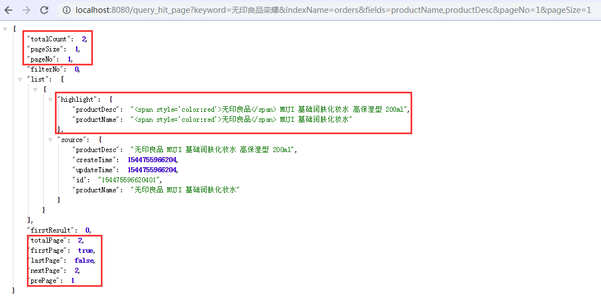

# springboot-elasticsearch

#### 一、项目介绍
Springboot2.1.1+elasticsearch6.5.3搭建的企业级搜索平台，支持PB级数据（需要elasticsearch分布式部署），目前已经支持中文分词，检索关键词高亮操作，如果帮到您，麻烦点下Star，谢谢。

另外 Springboot2.1+Solr7.5 搭建的搜索引擎，已经支持文档搜索、数据库搜索、中文分词等。 [https://gitee.com/11230595/springboot-solr](https://gitee.com/11230595/springboot-solr)

#### 二、软件架构
1. Springboot2.1.1
2. elasticsearch6.5.3
3. spring-boot-starter-data-elasticsearch
4. analysis-ik 6.5.3

#### 三、配置教程

1. elasticsearch6.5.3  <br/>
    - 下载 <br/>
    https://www.elastic.co/cn/downloads/elasticsearch <br/>
    - 配置<br/>
    解压后，打开 ```config/elasticsearch.yml```，对其中两项配置进行修改 <br/>
        - ```cluster.name```集群名称，随便填写，或者使用默认的“my-application”，注意，后面Java链接elasticsearch时，需要该配置。
        - ```network.host```如果此不配置此项，其他机器无法链接当前elasticsearch。配置为：（0.0.0.0代表任何IP都可访问）
        - 启动 <br/>
        Mac/Linux：运行 ```bin/elasticsearch```<br/>
        Windows：运行 ```bin\elasticsearch.bat```
2. analysis-ik 6.5.3 <br/>
    - 安装执行命令： <br/>
    ```bin/elasticsearch-plugin install https://github.com/medcl/elasticsearch-analysis-ik/releases/download/v6.5.3/elasticsearch-analysis-ik-6.5.3.zip```
3. essearch <br/>
    标准springboot项目，导入IDE运行即可。
#### 四、essearch配置说明

1. 修改```application.properties->spring.data.elasticsearch.cluster-nodes```  elasticsearch地址
2. 修改```application.properties->spring.data.elasticsearch.cluster-name``` 集群名称，和上面配置的相对应
3. 各种操作方式，请参考：``` /src/test/java/com/zhou/essearch/EssearchApplicationTests.java ```测试类
4. 端口，文根等其他配置请可自行配置

#### 五、搜索接口返回数据截图
- 分页搜索接口 <br>
 <br>
- 普通搜索接口 <br>


#### 六、补充
1. 数据库数据同步，可自行安装插件。
2. 如需mq、接口方式同步数据，请查看项目中的save接口模块。

#### 建议搜索
此版本修改过一些逻辑，添加了建议搜索 https://github.com/ciweigg2/springboot-elasticsearch-ik-suggest
```java
普通建议搜索 根据传来的keyword匹配
http://localhost:8080/suggest?keyword=无印良品
response:
[
    "无印良品 MUJI 基础润肤化妆水",
    "无印良品水"
]
```

```java
高级建议搜索 根据传来的keyword进行分词后匹配
http://localhost:8080/suggestIk?keyword=无印良品
response:
[
    "无印良品的按时都是额荣耀",
    "荣耀永远绽放2"
]
```

```java
分词查询接口
http://localhost:8080/ik?index=orders&ikKeyword=我爱你苏州
[
    "我爱你",
    "爱你",
    "苏州"
]
```

```java
添加数据接口
POST请求
http://localhost:8080/save
{
	"productDesc": "无印良品 MUJI 基础润肤化妆水 高保湿型 200ml苏州",
	"createTime": 1545104427407,
	"updateTime": 1545104427407,
	"id": "154510442740605",
	"productName": "无印良品的按时都是额荣耀"
}
```

```java
查看索引
GET http://localhost:9200/orders/_mapping
删除索引
DELETE http://localhost:9200/orders
查看索引的数据
GET http://localhost:9200/orders/_search
```

源码地址：https://gitee.com/11230595/springboot-elasticsearch